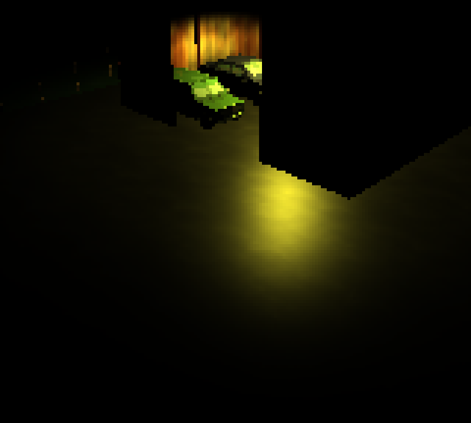
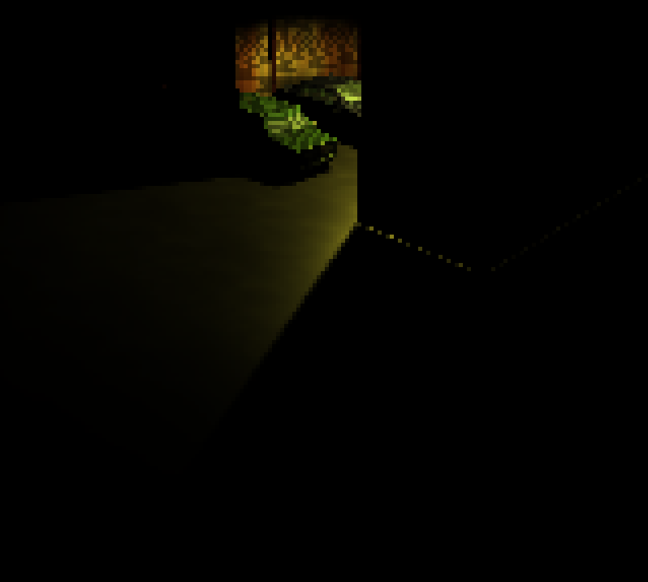
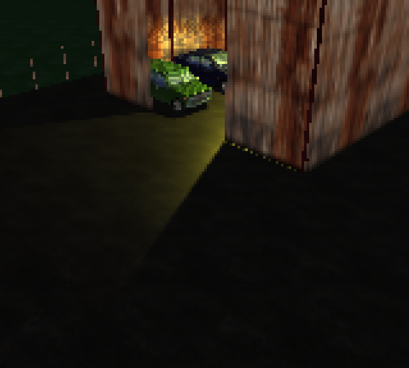
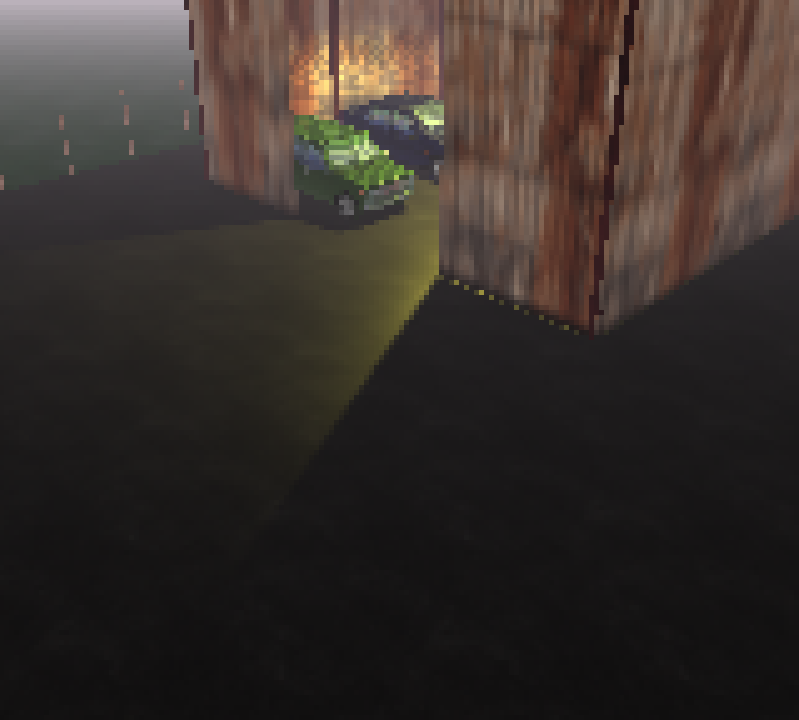
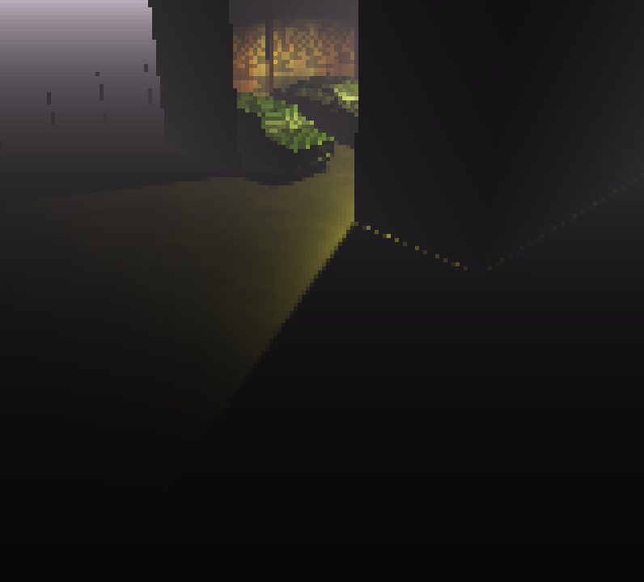
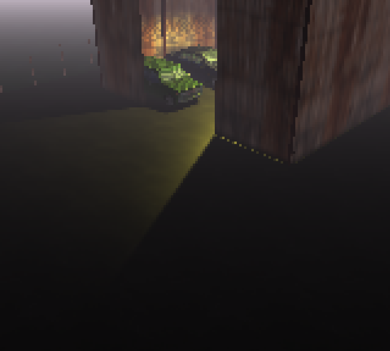
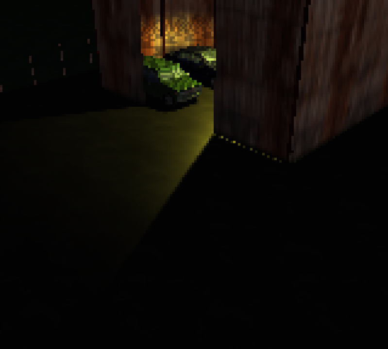
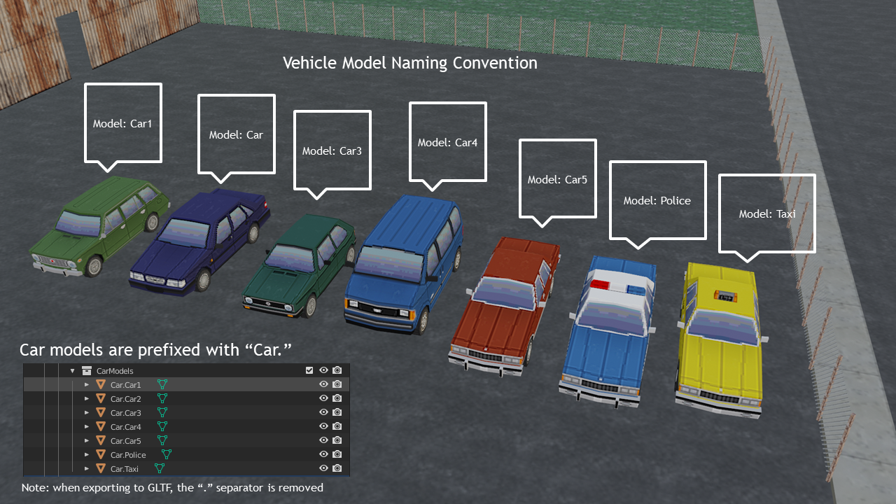
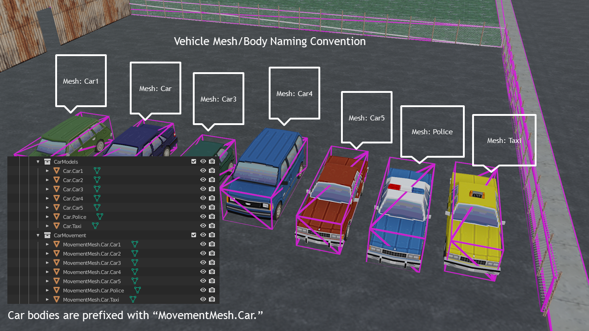
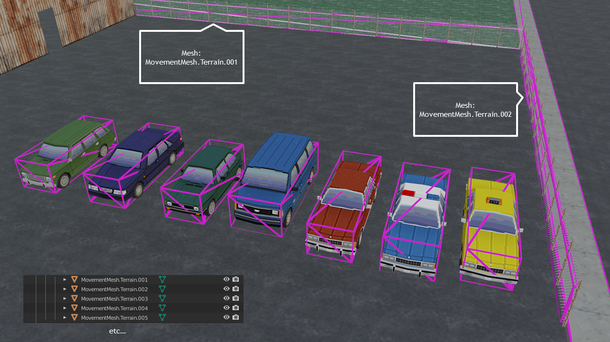

# breakreality

Development repository for itch.io Mini Jame Gam #10

## Collaborators:
- [Liam Osler](http://github.com/liamosler)
- [Brian Wo](http://github.com/brainwo)

## Description:

It's a game?

## Libraries and Assets:

### Graphics:

[three.js](http://threejs.org):
- GLTFLoader

### Physics:
[cannon.js](https://schteppe.github.io/cannon.js/)


### 3D Assets used:

3D Models and Textures:

Retro3DGraphicsCollection (Miziziziz):
https://github.com/Miziziziz/Retro3DGraphicsCollection

PSX Style Cars (GGBotNet):
https://ggbot.itch.io/psx-style-cars

Retro Urban Kit (Kenney):
https://kenney.nl/assets/retro-urban-kit

Retro PSX Style Tree Pack (Elegant Crow):
https://elegantcrow.itch.io/psx-retro-style-tree-pack

Ps1 style industrial buildings (miziziziz)
https://nartier.itch.io/ps1-style-industrial-buildings

## Notes / Requirements:

Viewing the game locally using the index.html file requires either CORS being allowed by the browser (alternatively, host the repo locally with http)

## Details:


### Blender .gltf export settings:


### Basic ```.gltf``` Three Scene setup with low resolution rendering and sharp pixelation:


Setup a three.js scene:
```js
    const threeDOM = document.getElementById("three-area");
    const scene = new THREE.Scene();
```

Create a GLTFLoader use the load function to load the file, and add it to the scene: 
```js
    const loader = new THREE.GLTFLoader();
    loader.load( 'assets/world.gltf', function ( gltf ) {
        const model = gltf.scene;
        scene.add(model);
    } );
```
- The .gltf contains the models, shaders (principled BSDF in Blender), textures and lights in one single file.

Basic three.js renderer setup:
```js
    const resolution = {x: 160, y: 144};
    const renderer = new THREE.WebGLRenderer();
    renderer.setSize( resolution.x, resolution.y );
    renderer.physicallyCorrectLights = true; //Ensures lights match Blender renders
    renderer.setClearColor( 0xffffff, 0);
    threeDOM.appendChild( renderer.domElement );
```

Basic Camera setup:
```js
    const camera = new THREE.PerspectiveCamera( 45, resolution.x/resolution.y, 1, 200 );
    camera.up.set( 0, 0, 1 );
    camera.position.set( -25,-25, 25 );
    camera.lookAt( 0, 0, 0 );
```

Basic animation function setup:
```js
    function animate() {
        requestAnimationFrame( animate );
        renderer.render( scene, camera );
    }

    animate();
```

Barebones GLTFLoader with pixellated styling ```.html``` file:
```html
<!DOCTYPE html>
<html lang="en">
<head>
    <meta charset="UTF-8">
    <meta http-equiv="X-UA-Compatible" content="IE=edge">
    <meta name="viewport" content="width=device-width, initial-scale=1.0">
    <title>GLTFLoader</title>
    <style>
        body { 
            margin: 0;
        }
        
        #three-area {
            image-rendering: pixelated;
            zoom: 4;
        }
    </style>
</head>

<body>
    <div id="three-area"></div>
</body>

<script src="scripts/three.js"></script>
<script src="scripts/GLTFLoader.js"></script>
<script>
    const threeDOM = document.getElementById( "three-area" );
    const scene = new THREE.Scene();

    const loader = new THREE.GLTFLoader();
    loader.load( 'assets/world.gltf', function ( gltf ) {
        const model = gltf.scene;
        scene.add( model );
    } );

    const resolution = {x: 160, y: 144};
    const renderer = new THREE.WebGLRenderer();
    renderer.setSize( resolution.x, resolution.y );
    renderer.physicallyCorrectLights = true; //Ensures lights match Blender renders
    renderer.setClearColor( 0xffffff, 0);
    threeDOM.appendChild( renderer.domElement );

    const camera = new THREE.PerspectiveCamera( 45, resolution.x/resolution.y, 1, 200 );
    camera.up.set( 0, 0, 1 );
    camera.position.set( -25,-25, 25 );
    camera.lookAt( 0, 0, 0 );

    function animate() {
        requestAnimationFrame( animate );
        renderer.render( scene, camera );
    }

    animate();
</script>
</html>
```
Results:


## Enhancing the scene:

### Adding shadows:

Add ```castShadow = true``` and ```receiveShadow = true``` to the all of the meshes in the GLTF file:
```js
    loader.load( 'assets/world.gltf', function ( gltf ) {
        const model = gltf.scene;

        model.traverse( function( node ) {
            node.castShadow = true;
            node.receiveShadow = true;
        } );

        scene.add( model );
    } );
```

Ensure  ```renderer.shadowMap.enabled = true```

Results:


### Adding ambient light:

```js
    const ambientLight = new THREE.AmbientLight( 0xffffff );
    ambientLight.intensity = 4;
    scene.add( ambientLight );
```
Results:


### Adding fog:

Slightly pink fog:
```js
    scene.fog = new THREE.Fog(0xffeeff, 1, 100);
```

Results with ambient lighting enabled:


Results with ambient lighting disabled:


Alternatively, similar results can be achieved with hemisphere lighting, giving a more realistic sunlight effect as faces have distinct brightness based on their orientation:
```js
    const light = new THREE.HemisphereLight( 0xffeeff, 0x080820, 2 );
    scene.add( light );
```
Results with hemisphere light and fog enabled, no ambient lighting:

Results with hemisphere light, no ambient lighting or fog:


### Model/Mesh/Object naming scheme:




## Physics:
### cannon.js setup:
See: https://github.com/schteppe/cannon.js/wiki/Hello-Cannon.js%21
World:
```js
    var world = new CANNON.World();
    world.broadphase = new CANNON.SAPBroadphase(world);
    world.gravity.set(0, 0, -10);
    world.defaultContactMaterial.friction = 0;
```

Create a plane for the ground: 
```js
    var groundBody = new CANNON.Body({
        mass: 0 // mass: 0 makes the body static
    });
    var groundShape = new CANNON.Plane();
    groundBody.addShape(groundShape);
    world.addBody(groundBody);
```

World materials and contact setup:
```js
    var groundMaterial = new CANNON.Material("groundMaterial");
    var wheelMaterial = new CANNON.Material("wheelMaterial");
    var wheelGroundContactMaterial = window.wheelGroundContactMaterial = new CANNON.ContactMaterial(wheelMaterial, groundMaterial, {
        friction: 1.5,
        restitution: .1,
        contactEquationStiffness: 1000
    });
```

Vehicle physics setup:
```js
    var chassisShape;
    chassisShape = new CANNON.Box(new CANNON.Vec3(2, 1,0.5));
    var chassisBody = new CANNON.Body({ mass: 500 });
    chassisBody.addShape(chassisShape);
    chassisBody.position.set(0, 0, 1);

    vehicle = new CANNON.RaycastVehicle({
        chassisBody: chassisBody,
    });

    options.chassisConnectionPointLocal.set(1, 1, 0);
    vehicle.addWheel(options);

    options.chassisConnectionPointLocal.set(1, -1, 0);
    vehicle.addWheel(options);

    options.chassisConnectionPointLocal.set(-1, 1, 0);
    vehicle.addWheel(options);

    options.chassisConnectionPointLocal.set(-1, -1, 0);
    vehicle.addWheel(options);

    vehicle.addToWorld(world);

    var wheelBodies = [];
    for(var i=0; i<vehicle.wheelInfos.length; i++){
        var wheel = vehicle.wheelInfos[i];
        var cylinderShape = new CANNON.Cylinder(wheel.radius, wheel.radius, wheel.radius / 2, 20);
        var wheelBody = new CANNON.Body({ mass: 1 });
        var q = new CANNON.Quaternion();
        q.setFromAxisAngle(new CANNON.Vec3(1, 0, 0), Math.PI / 2);
        wheelBody.addShape(cylinderShape, new CANNON.Vec3(), q);
        wheelBodies.push(wheelBody);
    }

    world.addEventListener('postStep', function(){
        for (var i = 0; i < vehicle.wheelInfos.length; i++) {
            vehicle.updateWheelTransform(i);
            var t = vehicle.wheelInfos[i].worldTransform;
            wheelBodies[i].position.copy(t.position);
            wheelBodies[i].quaternion.copy(t.quaternion);
        }
    });
```

Setup the cannon simulation loop:
```js
    var fixedTimeStep = 1.0 / 60.0;
    var maxSubSteps = 3;

    var lastTime;
    (function simloop(time){
    requestAnimationFrame(simloop);
    if(lastTime !== undefined){
        var dt = (time - lastTime) / 1000;
        world.step(fixedTimeStep, dt, maxSubSteps);
    }
    lastTime = time;
    })();
```

Vehicle controls:
```js
    document.onkeydown = handler;
    document.onkeyup = handler;

    var maxSteerVal = 0.5;
    var maxForce = 1000;
    var brakeForce = 1000000;
    function handler(event){
        var up = (event.type == 'keyup');

        if(!up && event.type !== 'keydown'){
            return;
        }

        vehicle.setBrake(0, 0);
        vehicle.setBrake(0, 1);
        vehicle.setBrake(0, 2);
        vehicle.setBrake(0, 3);

        switch(event.keyCode){

        case 38: // forward
            vehicle.applyEngineForce(up ? 0 : -maxForce, 2);
            vehicle.applyEngineForce(up ? 0 : -maxForce, 3);
            break;

        case 40: // backward
            vehicle.applyEngineForce(up ? 0 : maxForce, 2);
            vehicle.applyEngineForce(up ? 0 : maxForce, 3);
            break;

        case 66: // b
            vehicle.setBrake(brakeForce, 0);
            vehicle.setBrake(brakeForce, 1);
            vehicle.setBrake(brakeForce, 2);
            vehicle.setBrake(brakeForce, 3);
            break;

        case 39: // right
            vehicle.setSteeringValue(up ? 0 : -maxSteerVal, 0);
            vehicle.setSteeringValue(up ? 0 : -maxSteerVal, 1);
            break;

        case 37: // left
            vehicle.setSteeringValue(up ? 0 : maxSteerVal, 0);
            vehicle.setSteeringValue(up ? 0 : maxSteerVal, 1);
            break;

        }
    }
```

Animating the models with THREE with cannon physics:

Define a list of the cars, with their particular details:
```js
    let carList = [
                    {
                        name: "Player",
                        mass: 5000
                    },
                    {
                        name: "Car1",
                        mass: 5000
                    },
                    {
                        name: "Car2",
                        mass: 5000
                    },
                    {
                        name: "Car3",
                        mass: 5000
                    },
                    {
                        name: "Car4",
                        mass: 5000
                    },
                    {
                        name: "Car5",
                        mass: 5000
                    },
                    {
                        name: "Police",
                        mass: 5000
                    },
                    {
                        name: "Taxi",
                        mass: 5000
                    }
                ];
```

And define an array of the same length for keeping a collection of each vehicle's objects:
```js
    let carCollections = [...Array(carList.length)].map(e => Array(0));
```

During the .gltf load:
```js
    let loadStatus = false;
    loader.load( 'http://localhost:8000/test.gltf', function ( gltf ) {
        const model = gltf.scene;
        for( child of model.children ){
            if( child.name.search( "Car" ) == 0){
                for( let i = 0; i < carList.length; i++ ){
                    let carName = carList[i];
                    if(child.name.search( "Car" + carName ) == 0){
                        carCollections[i].push( child );
                        carCollections[i].name = carName;
                    }
                }
            }
        }
        loadStatus = true;
    } );
```

Animating the movement:
```js
    function animate() {

        requestAnimationFrame( animate );

        if( loadStatus == true ){ 
            for(let car of carCollections){
                if(car == carCollections[0]){
                    for(let item of car){
                        item.quaternion.copy(vehicle.chassisBody.quaternion);
                        item.position.x = vehicle.chassisBody.position.x;
                        item.position.y = vehicle.chassisBody.position.y;
                        item.position.z = vehicle.chassisBody.position.z;
                    }
                }
            }
        }
    }
```

Moving the wheels around:
```js
    for(let car of carCollections){
        if(car == carCollections[0]){
            for(let item of car){
                item.quaternion.copy(vehicle.chassisBody.quaternion);
                item.position.x = vehicle.chassisBody.position.x;
                item.position.y = vehicle.chassisBody.position.y;
                item.position.z = vehicle.chassisBody.position.z;

                if(item.name == "CarPlayerWheel1"){
                    item.quaternion.copy(wheelBodies[0].quaternion);
                    item.position.x = wheelBodies[0].position.x;
                    item.position.y = wheelBodies[0].position.y;
                    item.position.z = wheelBodies[0].position.z;

                }
                
                if(item.name == "CarPlayerWheel2"){
                    item.quaternion.copy(wheelBodies[1].quaternion);
                    item.position.x = wheelBodies[1].position.x;
                    item.position.y = wheelBodies[1].position.y;
                    item.position.z = wheelBodies[1].position.z;
                }
                
                if(item.name == "CarPlayerWheel3"){
                    item.quaternion.copy(wheelBodies[2].quaternion);
                    item.position.x = wheelBodies[2].position.x;
                    item.position.y = wheelBodies[2].position.y;
                    item.position.z = wheelBodies[2].position.z;
                }
                
                if(item.name == "CarPlayerWheel4"){
                    item.quaternion.copy(wheelBodies[3].quaternion);
                    item.position.x = wheelBodies[3].position.x;
                    item.position.y = wheelBodies[3].position.y;
                    item.position.z = wheelBodies[3].position.z;
                }

            }
        }
    }
```

Handling the MovementMesh:

```js
    if(child.name.search("MovementMeshTerrain") == 0){
        var shape = new CANNON.Box(new CANNON.Vec3(child.scale.x,child.scale.y,child.scale.z));
        var boxBody = new CANNON.Body({ mass: 0 });
        boxBody.addShape(shape);
        boxBody.position.set(child.position.x,child.position.y,child.position.z);
        boxBody.quaternion.w = child.quaternion.w;
        boxBody.quaternion.x = child.quaternion.x;
        boxBody.quaternion.y = child.quaternion.y;
        boxBody.quaternion.z = child.quaternion.z;
        boxBody.updateMassProperties();
        world.add(boxBody);
        child.visible = false;
    } 
```

Animating these bodies:

```js
    for(let body of world.bodies){
        if(body.name == "MovementMeshCar" + car.name){
            for(let item of car){
                item.quaternion.copy(body.quaternion);
                item.rotateX(Math.PI/2);
                item.position.x = body.position.x;
                item.position.y = body.position.y;
                item.position.z = body.position.z;
            }
        }
    }
```

## Cameras:

### Setting up OrbitControls:
Orbit controls is useful for being able to preview the model/game area. It allows you to orbit and pan a model by dragging the mouse and using the scroll wheel:

```js
    const controls = new THREE.OrbitControls( camera, renderer.domElement );
    controls.update();
```


### Chase camera:

```js
    function cameraSet(){
        var relativeCameraOffset = new THREE.Vector3(-20,0,10);
        var cameraOffset = relativeCameraOffset.applyMatrix4( carCollections[0].matrixWorld );

        camera.position.x = cameraOffset.x;
        camera.position.y = cameraOffset.y;
        camera.position.z = cameraOffset.z;
        camera.lookAt( cube.position );
    }

```